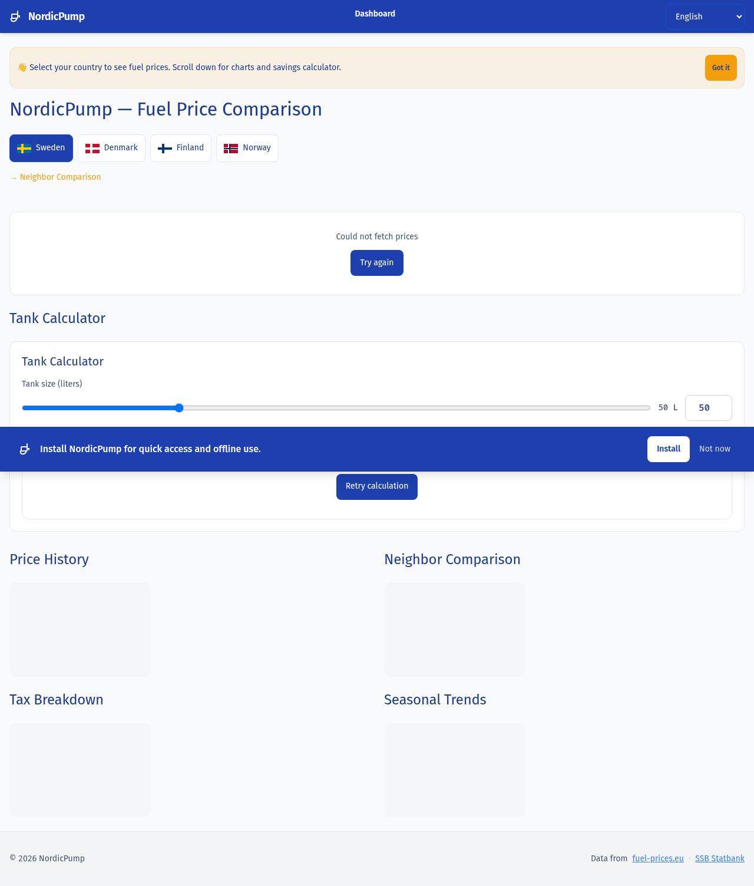
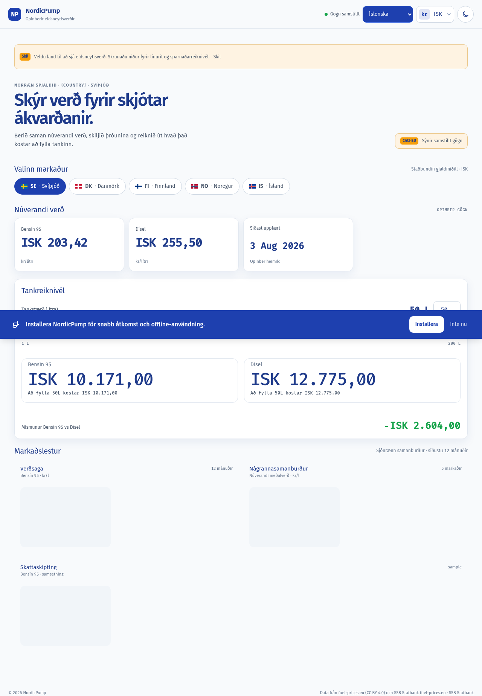

# ⛽ NordicPump

> Compare fuel prices across the Nordic countries — Sweden, Denmark, Finland, Norway, and Iceland. One app, one currency, seven languages.


A mobile-first **PWA** that unifies fuel price data from four official Nordic sources into a single dashboard. No database — the backend is a proxy/cache with atomic file writes and per-country indices. The frontend is Angular 22 with signals, standalone components, and offline support.

---

## Screenshots

| Desktop dashboard | Mobile (Iceland) |
|---|---|
|  |  |

---

## Why?

Fuel prices in the Nordics are published by different official sources with different formats, cadences, and currencies. A driver crossing the Sweden→Norway border has no easy way to compare prices without opening 3–4 websites and doing mental currency conversion. NordicPump solves that.

---

## Features

- **5 countries**: 🇸🇪 SE · 🇩🇰 DK · 🇫🇮 FI · 🇳🇴 NO · 🇮🇸 IS
- **2 fuels**: Euro 95 (Bensin 95) · Diesel
- **7 languages**: sv (default) · da · nb · fi · en · es · is — with auto currency per language
- **Live currency switching**: SEK · DKK · NOK · EUR · ISK
- **KPI cards** with current prices and trend indicators
- **Tank calculator**: how much to fill up, in your currency
- **Charts**: price history (12 months), neighbor comparison (5 countries), tax breakdown (doughnuts)
- **PWA**: installable, offline-capable, service worker with cached data fallback

---

## Architecture

```
Frontend (Angular 22 PWA)          Backend (Litestar proxy/cache)
┌──────────────────────┐           ┌──────────────────────────┐
│  Dashboard + charts  │──HTTP────▶│  Routes → Services        │
│  7 languages         │  /api/v1/ │    ↓                      │
│  Currency switcher   │           │  CacheStore (JSON atomic) │
│  PWA (offline)       │           │    ↓                      │
└──────────────────────┘           │  Ingestion → External APIs│
                                   └──────────────────────────┘
```

**No database.** Cache is file-based JSON with POSIX atomic writes (`os.replace`) and per-country index files for O(1) lookup.

**External data sources:**

| Source | Countries | Cadence |
|--------|-----------|---------|
| fuel-prices.eu | SE, DK, FI | Weekly (Sunday) |
| SSB Statbank | NO | Monthly (1st + 15th) |
| gasvaktin.is | IS | 2-day window |
| ECB | EUR→SEK/DKK/NOK | Daily |

---

## Tech Stack

| Layer | Technology | Why |
|-------|-----------|-----|
| Frontend | Angular 22 (signals, standalone, OnPush) | Modern Angular, strong in Swedish enterprise market |
| Backend | Litestar (Python 3.14 ASGI) | Strict typing, OpenAPI, opinionated structure |
| Cache | File-based JSON | No DB needed for ~10 records × 5 countries |
| Charts | Chart.js 4 | Tree-shakeable, responsive |
| i18n | ngx-translate | 7 languages with `{{param}}` interpolation |
| Tests FE | Vitest 4 | 380 tests, jsdom |
| Tests BE | pytest | 170 tests, asyncio |
| Linting | ruff + mypy strict | ruff (E,F,I,N,W,UP), mypy strict |

---

## Quick Start

### Backend (from `backend/`, requires Python 3.14+)

```bash
python -m venv .venv
source .venv/bin/activate    # fish: source .venv/bin/activate.fish
pip install -e ".[dev]"
uvicorn app:create_app_from_env --factory --host 0.0.0.0 --port 8000
```

### Frontend (from `frontend/`, requires Node 20+)

```bash
pnpm install
pnpm start    # → http://localhost:4200 (proxies /api → :8000)
```

Open http://localhost:4200 — start the backend first.

---

## Testing

```bash
# Backend (from backend/)
.venv/bin/pytest -q                    # all 170 tests
.venv/bin/pytest -m unit               # unit only

# Frontend (from frontend/)
pnpm test                              # all 380 tests
pnpm test -- --include src/path/to/file.spec.ts   # single file

# Linting & types (backend)
.venv/bin/ruff check .
.venv/bin/mypy .
```

A **pre-commit hook** runs all four checks (ruff + mypy + pytest + vitest) before every commit. Install it with:

```bash
bash scripts/install-precommit.sh
```

---

## Project Structure

```
NordicPump/
├── backend/                  # Litestar proxy/cache
│   ├── app.py                # Assembly + lifespan (scheduler)
│   ├── routes/               # health, prices, rates
│   ├── services/             # PriceQueryService, IngestionPipeline
│   ├── cache/                # CacheStore (atomic I/O), CacheFreshness
│   ├── ingestion/            # Parsers: fuel_prices_eu, ssb, iceland, ecb_rates
│   ├── scheduler.py          # In-process async scheduler (cadences per source)
│   └── tests/                # 170 pytest tests
├── frontend/                 # Angular 22 PWA
│   └── src/app/
│       ├── core/             # Services (Currency, PriceApi, Theme, Language)
│       ├── features/         # Dashboard, About
│       ├── shared/           # Charts, widgets, models, currency-switcher
│       ├── layout/           # Header, Footer
│       └── pwa/              # Install prompt, freshness banner, offline
├── countries.json            # Single source of truth → codegen
├── scripts/
│   ├── generate_countries.py # countries.json → enum (Py) + type (TS)
│   ├── pre-commit.sh         # ruff + mypy + pytest + vitest
│   └── inject_contract_edges.py  # Cross-repo graph edges
├── api-contract.yaml         # HTTP contract (frontend ↔ backend)
└── docs/inmersive/           # Interactive study guide (HTML)
```

---

## Key Decisions

| Decision | Chosen | Rejected | Why |
|----------|--------|----------|-----|
| Framework | Litestar | FastAPI, Django | Strict typing, opinionated structure |
| Persistence | JSON files | SQLite, Redis | Small dataset, portable, no dependencies |
| Scheduler | In-process async | cron, Celery | Single instance, no external broker |
| Country data | `countries.json` + codegen | Shared types | Python and TS can't share code — one source generates both |

Full trade-off analysis in the [interactive study guide](docs/inmersive/index.html).

---

## Roadmap

- [x] 5 Nordic countries with real data sources
- [x] 7 languages with auto-currency
- [x] PWA with offline support
- [x] 550 tests (380 FE + 170 BE) with pre-commit hook
- [x] Single source of truth for countries (`countries.json` + codegen)
- [ ] Live deploy (Netlify + Render)
- [ ] Baltic countries (Estonia, Latvia, Lithuania)
- [ ] Cache benchmark (hit vs miss latency)

---

## License

MIT — see [LICENSE](LICENSE).

---

Built by [Alejandro Martínez](https://github.com/AlejandroGML) · Stockholm, Sweden 🇸🇪
