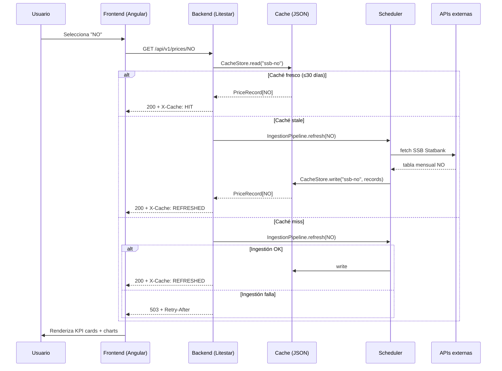

# NordicPump — Architecture

NordicPump es una **PWA mobile-first** que compara precios de combustibles (Euro 95 y Diésel) entre los 5 países nórdicos: **Suecia, Dinamarca, Finlandia, Noruega e Islandia**. El frontend es **Angular 22** y el backend es un proxy/caché en **Litestar (Python 3.14)**. No hay base de datos: el caché es file-based con escrituras atómicas. La app soporta **7 idiomas** y muestra precios en la moneda nativa de cada país.

## Contexto

El problema: los precios de combustibles en los países nórdicos se publican en fuentes oficiales distintas (fuel-prices.eu para SE/DK/FI, SSB Statbank para NO, gasvaktin.is para IS), con cadencias distintas (semanal, mensual, quincenal) y en monedas distintas (SEK, DKK, NOK, EUR, ISK). Un conductor que cruza la frontera Suecia→Noruega no tiene forma fácil de comparar precios entre ambos países sin abrir 3 apps distintas y hacer conversiones mentales.

NordicPump resuelve eso: unifica las fuentes, normaliza a EUR internamente, y deja al usuario elegir en qué moneda ver los precios. Sin esta app, el usuario tendría que visitar 3-4 sitios oficiales, anotar precios, convertir monedas manualmente, y perder 10 minutos por consulta.

:::why
Elegimos construir NordicPump porque resuelve una necesidad real del día a día nórdico (comparar precios cruzando fronteras), nos obliga a integrar APIs públicas reales con sus particularidades (cadencias, formatos, monedas), y produce un proyecto de portafolio que le habla directamente al mercado técnico sueco: datos nórdicos, idiomas nórdicos, monedas nórdicas.
:::

## Arquitectura

:::diagram-star id="arch" sticky="true"
<svg viewBox="0 0 900 280" xmlns="http://www.w3.org/2000/svg">
  <g data-section="frontend">
    <rect x="20" y="110" width="140" height="60" rx="10" fill="currentColor" opacity="0.12"/>
    <text x="90" y="138" text-anchor="middle" font-weight="600">Frontend</text>
    <text x="90" y="156" text-anchor="middle" font-size="11" opacity="0.7">Angular 22 (PWA)</text>
  </g>
  <path data-section="http-contract" d="M160,140 L300,140" stroke="currentColor" stroke-width="2.5" fill="none" marker-end="url(#arrow)"/>
  <text data-section="http-contract" x="230" y="128" text-anchor="middle" font-size="10" opacity="0.6">HTTP /api/v1</text>
  <g data-section="backend">
    <rect x="300" y="80" width="160" height="120" rx="10" fill="currentColor" opacity="0.12"/>
    <text x="380" y="105" text-anchor="middle" font-weight="600">Backend</text>
    <text x="380" y="122" text-anchor="middle" font-size="11" opacity="0.7">Litestar (Python 3.14)</text>
    <text x="380" y="148" text-anchor="middle" font-size="10" opacity="0.6">routes → services</text>
    <text x="380" y="164" text-anchor="middle" font-size="10" opacity="0.6">→ cache → ingestion</text>
  </g>
  <path data-section="backend-to-cache" d="M460,140 L600,140" stroke="currentColor" stroke-width="2.5" fill="none" marker-end="url(#arrow)"/>
  <g data-section="cache-file-based">
    <rect x="600" y="110" width="140" height="60" rx="10" fill="currentColor" opacity="0.12"/>
    <text x="670" y="138" text-anchor="middle" font-weight="600">Cache (JSON)</text>
    <text x="670" y="156" text-anchor="middle" font-size="11" opacity="0.7">file-based, atomic</text>
  </g>
  <path data-section="ingestion-apis-externas" d="M670,170 L670,220" stroke="currentColor" stroke-width="2.5" fill="none" marker-end="url(#arrow)"/>
  <g data-section="ingestion-apis-externas">
    <rect x="540" y="220" width="260" height="50" rx="10" fill="currentColor" opacity="0.08"/>
    <text x="670" y="240" text-anchor="middle" font-weight="600">Ingestion → APIs externas</text>
    <text x="670" y="258" text-anchor="middle" font-size="11" opacity="0.7">fuel-prices.eu · SSB · gasvaktin · ECB</text>
  </g>
  <defs>
    <marker id="arrow" viewBox="0 0 10 10" refX="8" refY="5" markerWidth="6" markerHeight="6" orient="auto-start-reverse">
      <path d="M0,0 L10,5 L0,10 z" fill="currentColor"/>
    </marker>
  </defs>
</svg>
:::

### Frontend

La interfaz que ve el usuario. Construida con **Angular 22** (standalone components, signals, change detection `OnPush`). Es una **PWA** con service worker para offline.

:::glossary
- **PWA (Progressive Web App)**: una web que se instala como app nativa en el celular, con icono en la pantalla de inicio y funcionamiento offline.
- **Standalone component**: componente Angular que no necesita un `NgModule` — se importa solo. Es el patrón moderno desde Angular 14+.
- **Signal**: una caja reactiva que avisa a la UI cuando cambia. Reemplaza al `Observable` de RxJS para estado local.
:::

Responsabilidades del frontend:
- Renderizar el dashboard: KPI cards con precios actuales, calculadora de tanque, gráficos (historial, comparativa, desglose de impuestos)
- Manejar 7 idiomas (sv, da, nb, fi, en, es, is) con `ngx-translate`
- Convertir monedas en vivo (currency switcher: SEK/EUR/DKK/NOK/ISK)
- Funcionar offline con service worker + fallback page

Estructura de carpetas (`frontend/src/app/`):
- `core/` — servicios (CurrencyService, PriceApiService, ThemeService, CountryStateService, LanguageService) + guards
- `features/` — dashboard y about
- `shared/` — componentes reutilizables (charts, widgets, models, currency-switcher)
- `layout/` — header y footer
- `pwa/` — service worker bits (install prompt, freshness banner, offline fallback)

### HTTP Contract

El puente entre frontend y backend. Está **documentado explícitamente** en `api-contract.yaml` porque el análisis estático no infiere llamadas HTTP — solo se ven los imports.

| Endpoint | Frontend caller | Backend handler | Service que resuelve |
|---|---|---|---|
| `GET /api/v1/prices/{country}` | `PriceApiService.fetch(country)` | `prices.py:prices_endpoint` | `PriceQueryService.resolve(country)` |
| `GET /api/v1/rates` | `CurrencyService.loadRates()` | `rates.py:rates_endpoint` | `IngestionPipeline.get_rates()` |
| `GET /health` | (monitoring) | `health.py:health_check` | (pure function) |

:::glossary
- **Contract test**: un test que verifica que dos lados (frontend y backend) hablan el mismo idioma. En NordicPump, `price.contract.spec.ts` lee el código Python y el TypeScript y compara que los campos y los enums coincidan — si alguien cambia un lado, el test revienta.
:::

### Backend

El proxy/caché. Construido con **Litestar** (framework ASGI de Python, alternativa moderna a FastAPI). **Sin base de datos**: el caché vive en archivos JSON en disco.

:::glossary
- **ASGI**: Asynchronous Server Gateway Interface — el estándar de Python para servidores web async. Litestar, FastAPI y Starlette lo usan.
- **Litestar**: framework web Python con tipado estricto, validación Pydantic, y OpenAPI automático. Más opinionated que FastAPI.
:::

Capas del backend (de afuera hacia adentro):

1. **Routes** (`routes/`) — reciben HTTP, validan el país, delegan al service. No tienen lógica de negocio.
2. **Services** (`services/`) — `PriceQueryService` (lee caché, cache-first), `IngestionPipeline` (escribe caché, orquesta ingestión).
3. **Cache** (`cache/`) — `CacheStore` (I/O atómica), `CacheFreshness` (lógica de tiempo).
4. **Ingestion** (`ingestion/`) — parsers de cada fuente externa (fuel_prices_eu, ssb, iceland, ecb_rates).
5. **Scheduler** (`scheduler.py` + `cadence/`) — scheduler in-process async que dispara ingestión según cadencias.
6. **Models** (`models/`) — `PriceRecord`, `Country` (StrEnum), `FuelType`, `CountryMeta`.

### Cache (file-based)

El corazón del backend. No usa SQLite ni Redis: usa **archivos JSON** en disco, con dos trucos clave:

:::step {n=1}
**Escrituras atómicas** con `tempfile + os.replace` (POSIX rename). El archivo nunca queda corrupto a medias: se escribe en un archivo temporal y se renombra atómicamente. Si el proceso muere a la mitad, el archivo original sigue intacto.
:::

:::step {n=2}
**Índices por país** para O(1) lookup. Además del archivo principal (`fuel-prices-eu.json` con todos los países), se escribe un índice por país (`fuel-prices-eu_idx_SE.json`, `_idx_DK.json`, etc.). Así `PriceQueryService` lee directamente el archivo del país sin escanear toda la lista.
:::

:::glossary
- **Escritura atómica**: garantía de que un archivo o se escribe completo o no se escribe nada. Nunca queda a medias. En POSIX, `os.replace()` es atómico: el rename ocurre en una sola operación del sistema de archivos.
- **O(1) lookup**: tiempo constante — tarda lo mismo sin importar cuántos datos haya. Es lo opuesto a O(n) donde hay que escanear todo.
- **POSIX**: estándar de sistemas operativos tipo UNIX (Linux, macOS). `os.replace` es la función Python que invoca la syscall atómica de rename.
:::

### Ingestion → APIs externas

Cada fuente externa tiene su propio parser y su propia cadencia:

| Fuente | Parser | Países | Cadencia | Por qué esa cadencia |
|---|---|---|---|---|
| fuel-prices.eu | `fuel_prices_eu.py` | SE, DK, FI | Domingos | Publican snapshot semanal los domingos |
| SSB Statbank | `ssb.py` | NO | 1° del mes + día 15 | Tabla mensual se publica a mediados de mes |
| gasvaktin.is | `iceland.py` | IS | Ventana 2 días | Estaciones actualizan cada 15 min, pero cachedeamos 2 días |
| ECB | `ecb_rates.py` | (rates) | Diario | Reference rates diarios del BCE |

:::warning
Islandia **no es UE**, así que el BCE (ECB) no publica EUR→ISK. NordicPump usa `open.er-api.com` como fuente para ISK, con fallback hardcodeado (`eur_isk_fallback: 140.00`) si esa API también cae.
:::

## Flujo de datos

¿Qué pasa cuando un usuario abre NordicPump y selecciona Noruega?

:::glossary
- **Cache-first**: patrón de lectura donde siempre se mira el caché primero. Si está fresco, se sirve de ahí. Si está viejo (stale), se intenta refrescar. Si no existe (miss), se intenta ingerir.
- **X-Cache header**: header HTTP que indica de dónde vino la respuesta: `HIT` (caché fresco), `REFRESHED` (se actualizó en esta request), `STALE` (se sirvió viejo porque la actualización falló).
- **Retry-After**: header HTTP que dice "intenta de nuevo en N segundos". Se manda con 503 para que el cliente sepa cuándo reintentar.
:::

## Tech Stack

| Capa | Tecnología | Versión | Por qué |
|---|---|---|---|
| Frontend | Angular | 22 | Standalone components + signals son el presente de Angular. Stack demandado en mercado sueco (fintech, enterprise). |
| Backend | Litestar | latest | Framework ASGI con tipado estricto + OpenAPI. Más opinionated que FastAPI — te empuja a hacerlo bien. |
| Runtime backend | Python | 3.14 | StrEnum, performance, match statements. |
| Cache | JSON files | — | Sin DB. Atomic writes + per-country indices. Suficiente para un dataset de ~5 países × 2 combustibles. |
| Charts | Chart.js | 4.x | Doughnuts, line charts. Tree-shakeable con registro manual de componentes. |
| i18n | ngx-translate | latest | Maduro, soporta 7 idiomas con interpolación `{{param}}`. |
| Tests frontend | Vitest | 4.x | Rápido, jsdom, integration con Angular unit-test builder. |
| Tests backend | pytest | latest | Markers unit/integration, pytest-asyncio. |
| Tipado Python | mypy strict | — | `noPropertyAccessFromIndexSignature` fuerza acceso por `['key']`. |
| Linting Python | ruff | latest | Line-length 120, select E,F,I,N,W,UP. |

## Trade-offs (Decisiones clave)

Cada decisión técnica tuvo alternativas que se descartaron con razón. Estas son las más importantes:

| Decisión | Elegido | Descartado | Razón [!decision] |
|---|---|---|---|
| Framework backend | Litestar | FastAPI, Django | Litestar te empuja a tipado estricto + estructura limpia. FastAPI es muy libre (cada quien lo arma distinto). Django es overkill para un proxy/caché sin DB. |
| Persistencia | JSON files | SQLite, Redis | El dataset es chico (~10 registros por país, 5 países). SQLite agrega una dependencia y migraciones. Redis es infra externa. JSON + atomic rename es suficiente y portátil. |
| Scheduler | In-process async | cron, Celery | Una sola instancia, sin workers distribuidos. Async in-process evita dependencias externas (Redis broker para Celery) y funciona igual en dev y prod. |
| Enum país | StrEnum | Enum clásico | StrEnum serializa directamente a `"SE"` en JSON sin `.value`. Menos código, menos bugs. |
| Lazy charts | `@defer (on viewport)` | Lazy routes | Los charts son caros de renderizar (Chart.js). `@defer` los carga solo cuando el usuario scrollea a ellos. Gotcha: Playwright fullPage screenshot NO los dispara — hay que scrollear programáticamente en tests. |
| Source of truth país | countries.json + codegen | Types compartidos | Backend (Python) y frontend (TS) son runtimes distintos — no pueden compartir código. Un JSON fuente + script que genera enum Python + type TS elimina la deuda de "5 lugares que tocar por país nuevo". |
| Atomic write | POSIX rename | File lock | `os.replace` es atómico a nivel syscall en POSIX. Un lock (fcntl o file-based) agrega complejidad y edge cases (proceso muere con el lock tomado). Rename es más simple y garantiza consistencia. |
| Signals vs RxJS | Signals | RxJS | Signals son el futuro de Angular (reactividad simple). RxJS sigue para eventos complejos (HTTP, debouncing) pero para estado local, signals son más legibles y performantes. |

## Failure Modes (Modos de fallo)

:::danger
**Crítico**: si el caché está vacío (miss) Y la ingestión falla (API externa caída), el backend devuelve **503 con Retry-After**. El usuario ve un mensaje de error traducido. No hay degradación elegante más allá de eso — no podemos inventar precios.
:::

:::warning
**ECB caído**: si el BCE no responde, los rates EUR→SEK/DKK/NOK usan fallback hardcodeado (11.50, 7.45, 12.00). Los precios convertidos pueden estar ligeramente desactualizados. Para ISK el fallback es 140.00 (vía open.er-api.com con su propio fallback).
:::

:::warning
**Isla desconectada**: el grafo de conocimiento del proyecto muestra 0 edges entre frontend y backend por defecto (análisis estático no infiere HTTP). Se soluciona con `api-contract.yaml` + `scripts/inject_contract_edges.py` que inyecta los edges manualmente.
:::

## Plan de escalabilidad

El sistema actual funciona para 5 países y un solo usuario concurrente. Si crece:

:::step {n=1}
**Más países** (ej. Países Bálticos): editar `countries.json` + correr `python scripts/generate_countries.py`. Las traducciones i18n y el flag SVG son manuales. El resto se autogenera.
:::

:::step {n=2}
**Más concurrencia**: el file-based cache funciona mientras un solo proceso escribe. Para multi-proceso, migrar a SQLite (misma atomicidad, mejor concurrencia) o Redis. El refactor es pequeño porque CacheStore tiene solo 3 métodos públicos (`read`, `write`, `exists`).
:::

:::step {n=3}
**Histórico largo**: actualmente el caché guarda solo el snapshot más reciente. Para series temporales largas, agregar append-only al archivo de caché (lista de snapshots) o tablas SQLite por país.
:::

## Glosario

:::glossary
- **ASGI**: Asynchronous Server Gateway Interface — estándar de Python para web servers async.
- **Atomic write**: escritura que nunca queda a medias. POSIX rename lo garantiza a nivel syscall.
- **Cache-first**: patrón de leer caché primero, refrescar solo si está viejo o ausente.
- **Cadence**: frecuencia con que una fuente publica datos. EU=semanal, SSB=mensual, ISK=diaria.
- **Codegen**: generación de código desde una fuente única. En NordicPump, `countries.json` genera el enum Python y el type TS.
- **Contract test**: test que valida que dos lados (frontend/backend) coincidan en campos y tipos.
- **Ingestion**: proceso de traer datos de una fuente externa y normalizarlos al formato interno.
- **Litestar**: framework web Python ASGI con tipado estricto. Alternativa a FastAPI.
- **O(1) lookup**: acceso en tiempo constante, sin importar el tamaño del dataset.
- **POSIX**: estándar de sistemas UNIX (Linux, macOS). Garantiza atomicidad de rename.
- **PWA**: Progressive Web App — web instalable como app nativa, con offline.
- **Signal**: caja reactiva de Angular que avisa a la UI cuando cambia.
- **Standalone component**: componente Angular sin NgModule, autónomo.
- **StrEnum**: enum de Python donde los miembros son strings. Serializa directo a JSON.
- **X-Cache header**: header HTTP que indica el origen de la respuesta (HIT/REFRESHED/STALE).
:::

## Próximos pasos

- [ ] Deploy (Netlify frontend + Render/Railway backend)
- [ ] README profesional con screenshots y URL demo
- [ ] GitHub público
- [ ] Benchmark: cache hit vs miss (latencia)
- [ ] Más países bálticos (Estonia, Latvia, Lithuania) — solo editar `countries.json`

---

:::info
**Cómo se genera esta doc**: `source.md` (este archivo) es la fuente única. Los pipelines `build-html.py`, `build-pdf.js`, `build-md.py`, y `build-narration.py` producen los formatos finales. Edita `source.md` y re-build para actualizar.
:::
